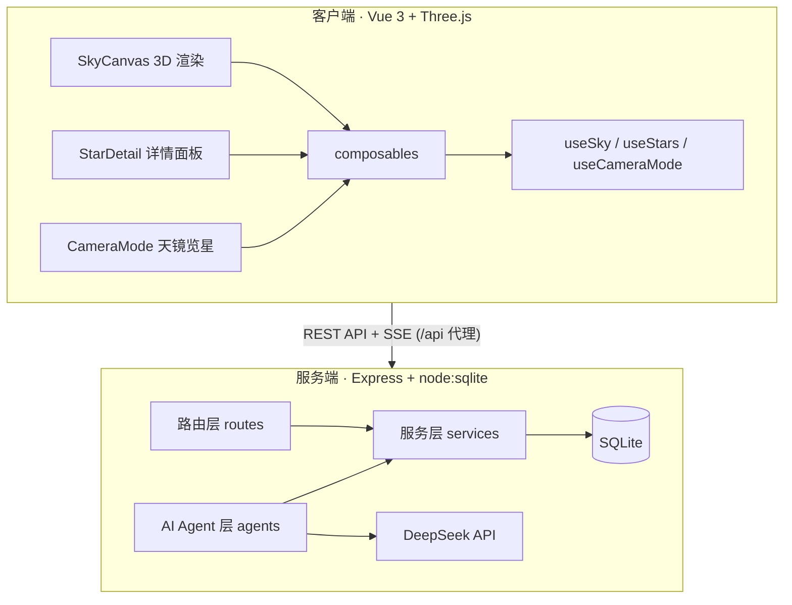

# Star Language Dome · 星语穹庭

> 一块让每一颗心事都落在星辰之上的 3D 星穹。

<div align="center">

**3D 星空情绪表达平台** · 真实星空 ✦ AI 情绪洞察 ✦ 匿名共鸣


</div>

---

## 目录

- [项目简介](#-项目简介)
- [我们想做什么](#-我们想做什么)
- [核心功能](#-核心功能)
- [系统架构](#-系统架构)
- [技术实现特色](#-技术实现特色)
- [创新点与差异化](#-创新点与差异化)
- [复赛阶段完善内容](#-复赛阶段完善内容)
- [本地运行](#-本地运行)
- [未来展望](#-未来展望)

---

## 🌌 项目简介

**星语穹庭（Star Language Dome）** 是一款融合**真实天文学、AI 情绪表达与社交共鸣**的 3D 星空情绪表达平台。

用户把心事**匿名**"挂"在某一颗真实星星上，万千情绪汇聚成一片会呼吸的星穹；通过「共鸣」形成温柔而克制的弱连接，用 AI 读懂情绪、归属星辰、生成诗意的叙事。

它既不是单纯的观星工具，也不是普通的日记 / 树洞社区，而是用**真实的星空**承载**真实的情绪**，再用 **AI 与共鸣**完成情绪的双向回响。

> 一句话：我们想让人在抬头看星时，不再只是"看星星"，而是"把心事寄给星星，并在星群里找到回响"。

---

## 💡 我们想做什么

### 背景与痛点

现代社会里，情绪表达面临两个普遍的困境：

- **表达难、无处安放**：心事往往不愿说给熟人听，公开平台又缺少安全、温柔的表达出口；
- **表达之后无人回应**：即使说出口，也常常得不到"被理解"的回响，情绪停留在"被看到"而非"被共鸣"。

**星空自带"倾诉的远方感"与"宇宙的包容感"。** 仰望星空时，人会自然而然地把心事托付给遥不可及的星——这是一种天然、无压力的情绪出口，只是现实中缺少一个把"心事"与"星辰"真正连接起来的载体。

### 目标用户

| 用户群体 | 核心诉求 | 产品满足方式 |
|---|---|---|
| 有情绪表达需求、不愿打扰熟人的年轻人 | 安全、匿名、温柔地倾吐心事 | 匿名投递 + 沉浸式星穹 |
| 天文 / 星空爱好者 | 享受真实、可交互的星空体验 | 真实星表 + 行星期 + 月相 + 天镜览星 |
| 追求自我探索的深度用户 | 获得对内心更深的理解 | AI 人格 / 情绪 / 时辰洞察 |
| 学生 / 泛内容消费者 | 有趣、有文学性的内容体验 | AI 叙事 + 与古人陪看聊天 |

---

## ✨ 核心功能

### 🪐 3D 星空渲染引擎

- **真实恒星**：内置第 6142 颗真实恒星，坐标由赤经赤纬**离线预计算**为 3D 坐标，天球半径 R=500，相机固定于球心，拖拽旋转、滚轮拉近。
- **星座连线**：按真实星官 / 星座张角连线，还原经典星座形态。
- **太阳系行星系统**：水星 → 海王星 + 太阳 + 月球，基于 **VSOP87 截断行星历**实时计算天体位置，含轨道、自转、视运动轨迹、悬浮淡光晕。
- **行星特写模式**：点击行星进入特写，动态调整相机距离实现"不断放大"的望远镜沉浸感；月球按**真实角直径视角**（约 0.518°）渲染，成为天球上最大可看清盘面的天体。
- **银河与月相**：多层叠加银河背景；实时月相渲染（含月相关联的古诗词）。

### 📜 心事 / 故事与共鸣

- 用户把心事（标题 + 正文 + 标签）**匿名**投递，可自由绑定到某一颗真实恒星或行星上。
- 其他用户可对故事「**共鸣**」，形成克制而温暖的弱连接。
- 支持收藏、浏览统计、故事被查看计数。

### 🤖 AI 能力矩阵

| 能力 | 说明 |
|---|---|
| **AI 归属星辰匹配** | 输入标题 + 正文 → 提取情感内核 → 匹配 Top3 最契合的星辰 + 匹配理由 + 推荐标签 |
| **AI 标签推荐** | 轻量实时推荐 3~5 个 AI 标签，助用户表达情绪 |
| **AI 叙事** | 为每颗星生成带天区与文学性的"星空叙事" |
| **古人陪看聊天** | 内置 23 位古人，SSE 流式实时对话，"与李白共赏" |
| **单星 AI 分析** | 人格画像（persona）+ 情绪解构（emotion）+ 主题 / 时辰洞察（themehour） |
| **合集 AI 解读** | 对整组故事做情绪、主题、时辰分布的综合解读 |

### 📚 星笺 / 合集系统

- 用户可把故事归入自己的「星笺」（合集）。
- 支持 **public / private / anonymous / galaxy 四种可见性**，自由控制情绪公开程度。
- 官方「星河八卷轴」与公开广场，支持搜索、排序、无限滚动。

### 🔭 天镜览星（Camera Mode）

- 框选当前视锥内的星星与故事，「观星 / 听语」双模式。
- PC 端取景框 + HUD + 视锥内故事列表；移动端单卡片轮播。
- 点击故事卡片飞镜头 + 打开详情，实现"指哪看哪"。

### 🧑‍🚀 个人空间（Style D 叙事沉浸式）

- 月亮 Hero + 时间轴 + 私人星座图 + 典藏星展，以"星空档案"呈现个人宇宙。

### 🔍 搜索与定位

- 星体关键词搜索 + 地理定位（高德 → BigDataCloud → Nominatim 三级回退）+ 天区匹配。

### 📱 移动端适配与性能

- 响应式断点 + 设备分级渲染（High / Medium / Low）+ 触控优化，全平台无缝体验。

### 🔐 身份认证与访客模式

- 注册 / 登录 / 匿名访客，允许未登录用户完整体验核心功能，降低使用门槛。

---

## 🏗️ 系统架构

### 总体架构（前后端分离 monorepo）



### 数据层设计

SQLite 承载核心数据，主要表结构：

| 表 | 用途 |
|---|---|
| `stars` | 历史星 + 用户星（含归属星、坐标、共鸣 / 浏览计数、origin） |
| `users` | 用户账户 |
| `collections` | 星笺 / 合集（含四态可见性） |
| `narratives` | AI 叙事 |
| `story_kernels` | 故事情感内核 |
| `catalog_star_analyses` | 单星 AI 分析缓存 |
| `collection_analyses` | 合集 AI 分析缓存 |
| `favorites` / `catalog_visits` | 收藏 / 浏览记录 |

### 关键设计原则

- **前端重、后端轻**：星座坐标、显示配置等离线预计算前置到前端，后端保持轻量、零外部依赖。
- **AI 懒生成 + 幂等缓存**：分析结果带 `story_hash` 幂等，同内容不重复计算，支持分批生成。
- **统一响应格式**：`{ code, message, data }`，前端统一处理。
- **匿名优先、无权限墙**：产品核心是"开放与温柔"。

---

## 🛠️ 技术实现特色

| 技术维度 | 实现方案 | 亮点 |
|---|---|---|
| 真实星表 | 6142 颗恒星坐标离线预计算为 JSON | 高精度 + 运行期零计算，性能优越 |
| 行星历 | VSOP87 截断历法（1″ 精度） | 满足视觉需求的真实行星位置 |
| 行星渲染 | 角直径视角 + 高低性能分级 | 滚动放大体验、全平台流畅 |
| 后端 | Express + TypeScript + `node:sqlite` | 零外部依赖、轻量易部署 |
| AI Agent | DeepSeek 工具链 + 幂等懒生成 | 标签 / 匹配 / 分析 / 叙事 / 聊天全链路 AI |
| 流式交互 | SSE 流式聊天 | 与古人实时多轮对话 |
| 前端工程 | Vue 3 + Vite + Three.js + 响应式 | 跨平台 + 设备分级渲染 |
| 部署 | GitHub Actions + Nginx（gzip + 缓存） | 自动化、高性能 |

---

## 🏆 创新点与差异化

1. **"情绪 × 真实星空"的独特结合**：不是把星空当背景，而是把真实天体作为情绪的"寄存处"，赋予情绪以宇宙级别的意义感。
2. **AI 深度情绪洞察**：从"归属星辰匹配"到"人格 / 情绪 / 时辰分析"再到"合集解读"，形成一套完整的 AI 情绪理解链路。
3. **古人陪看**：23 位古代诗人 / 哲人与用户实时共赏，把文化底蕴注入情绪陪伴。
4. **四态可见性合集**：public / private / anonymous / galaxy，精确控制每次情绪表达的边界。
5. **天镜览星**：把"现实夜空框进取景器"，实现观星与听语的沉浸式漫游。
6. **真实可信的观星体验**：真实星表 + VSOP87 行星期 + 真实月相，而非虚构场景。

---

## 🚀 复赛阶段完善内容

> 相较初赛，复赛阶段重点完成了"让星空更像星空、让体验更顺畅"的系统性打磨。

### 渲染与视觉完善

- **行星渲染比例重构**：放弃物理直径等比（导致小天体盘面亚像素不可见），改为**角直径视角**，水星 / 月球等从此清晰可见；月球按真实角直径 0.518° 调整，成为天球最大可看清盘面的天体。
- **行星悬浮光晕**：行星（含日月）补齐与恒星对等的悬浮淡光晕效果。
- **银河背景优化**：多层叠加 + 亮度调制，解决银河过亮"吃掉"星点、"糊屏"问题。

### 交互与体验完善

- **搜索定位精准度**（issue #154）：修复点击搜索结果时常误触发背景星故事面板的问题——点击主区域先移动相机定位再打开面板，并新增更严格的点击命中阈值，让"指哪看哪"真正生效。
- **移动端适配**：移除调试日志，修复三大入口在移动端溢出，单卡片轮播画廊体验。

### 功能与内容完善

- 官方「星河八卷轴」与公开广场、合集详情 AI 解读上线。
- 单星 AI 分析（persona / emotion / themehour）全量打通并接入合集解读。

---

## 🚀 本地运行

> 注意：后端使用内置实验模块 `node:sqlite`，需要 **Node.js ≥ 22.5**。

```bash
# 后端
cd server
npm install        # 首次安装依赖
npm run seed       # 注入冷启动数据
npm run dev        # 开发模式（nodemon + ts-node）

# 前端（另开终端）
cd client
npm install        # 首次安装依赖
npm run dev        # Vite 开发服务器（:5173）
```

前端 `vite.config.ts` 中 `/api` 代理到 `localhost:3000`，后端默认端口 3000（可用 `PORT` 覆盖）。

### 技术栈

| 端 | 技术 |
|---|---|
| 前端 | Vue 3 · Vite · Three.js · PrimeVue |
| 后端 | Node.js · Express · TypeScript · node:sqlite |
| AI | DeepSeek API · SSE 流式 |
| 部署 | GitHub Actions · Nginx · PM2 |

---

## 🔮 未来展望

- **更深的观星体验**：深入星空模式、更多天体细节、AR 识星。
- **更丰富的社区**：开放协作共笔、圈层互动、群聊邀请。
- **更强的 AI**：个性化情绪推荐、更自然的对话流、多轮整合分析。
- **更广的边界**：角色权限、日志监控、接口扩展、低端机型深度优化。

---

> 星语穹庭，愿每一颗心事都被温柔地接住，愿每一片星穹都有人仰望回响。